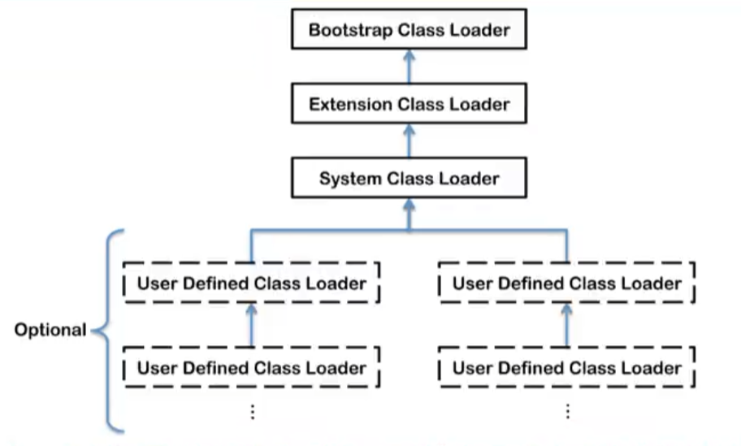

## 二、类加载子系统。

### 1. 类加载过程。

`加载（loading）` -> `链接（linking）（验证Verification -> 准备Preparation -> 解析Resolution）`-> `初始化（initialization）`。

#### loading阶段

通过全限定类名获取此类的二进制字节流  -> 将其代表的静态结构转为方法区的运行时数据结构 -> 在内存中生成一个代表这个类的java.lang.Class对象，作为方法区这个类的各种数据的访问入口。

#### linking阶段
1）验证，确保Class文件的字节流中包含的信息符合当前虚拟机要求，保证被加载类的正确性。包括四种验证：文件格式验证，元数据验证，字节码验证，符号引用验证。
2）准备。
- 为类变量（static）分配内存并且设置该类变量的默认初始值，即零值。
- 这里不包含用final修饰的static，因为final的值在编译的时候就会被分配，准备阶段会显示初始化。
- 不会为实例变量分配初始化，类变量会分配在方法区，而实例变量是会随着对象一起分配到Java堆中。
3）解析。将常量池内的符号引用转换为直接引用的过程。事实上，解析操作往往会伴随着JVM在执行完初始化之后再执行。...
#### initialization阶段
1） 初始化阶段就是执行类的构造器方法`<clinit>()`的过程，此方法不需要定义，是javac编译器自动收集类中的所有**类**变量的赋值动作和静态代码块中的语句合并而来。
2）如果类中不存在类变量和静态代码块则class文件中不会出现此方法。并且，其中的指令按语句在源文件中出现的顺序执行。
3）`<clinit>()`不同于类的构造器。（构造器是虚拟机视角下的`<init>()`方法）
4）若该类具有父类，JVM会保证子类的`<clinit>`执行前父类的`<clinit>`已经执行完毕。

### 2. 类加载器。

#### 类加载器的分类

1）JVM支持两种类型的的类加载器，分别为 *引导类加载器（Bootstrap ClassLoader* 和 *自定义类加载器（User-Defined ClassLoader）*，之所以这么说，从概念上讲，将所有派生于派生于抽象类ClassLoader的类加载器都归为自定义类加载器。也就说，常听说的拓展类加载器和系统（应用）类加载器都归为自定义类加载器。

**注**：这四者不是继承关系，是包含关系。引导类加载器不是使用java语言编写的（c/c++实现），其他的都是使用java语言编写。

2）系统（应用）类加载器的上层是拓展类加载器，拓展类加载器的上层是引导类加载器，我们可以获取到系统类加载器和拓展类加载器的对象，但是获取不到引导类加载器的对象。这里说的上层也被称为父类加载器，但是不是继承的含义。
3）普通自定义类的默认类加载器是系统类加载器，而类似String等的核心类库的类的类加载器则是引导类加载器。引导类加载器也用于加载拓展类加载器和系统类加载器。

4）拓展类加载器，会加载jre/lib/ext子目录（拓展目录）下的类库，如果用户创建的JAR放在此目录下，也会自动由拓展类加载器加载。

5）应用程序类加载器（系统类加载器），父类加载器为拓展类加载器，负责加载环境变量classpath或者java.class.path指定路径下的类库。其为程序中默认的类加载器，自定义的类都是由其加载。

#### 自定义类加载器

为什么要自定义类加载器？
- 隔离加载类（避免类冲突）
- 修改类的加载方式
- 拓展加载源
- 防止源码泄露（加密字节码文件，自定义类加载器对其解密）

####  双亲委派机制

工作原理：
1）如果一个类加载器收到了类加载请求，它并不会自己先去加载，而是把这个请求委托给父类的加载器去执行；
2）如果父类加载器还存在其父类加载器，则进一步向上委托，依次递归，请求最终到达顶层的引导类加载器；
3）如果父类加载器可以完成类的加载任务，就成功返回，如果父类加载器无法完成此加载任务，子类加载器才会尝试自己去加载，这就是双亲委派机制。
4）避免类的重复加载；保护程序安全，防止核心API被随意篡改。
